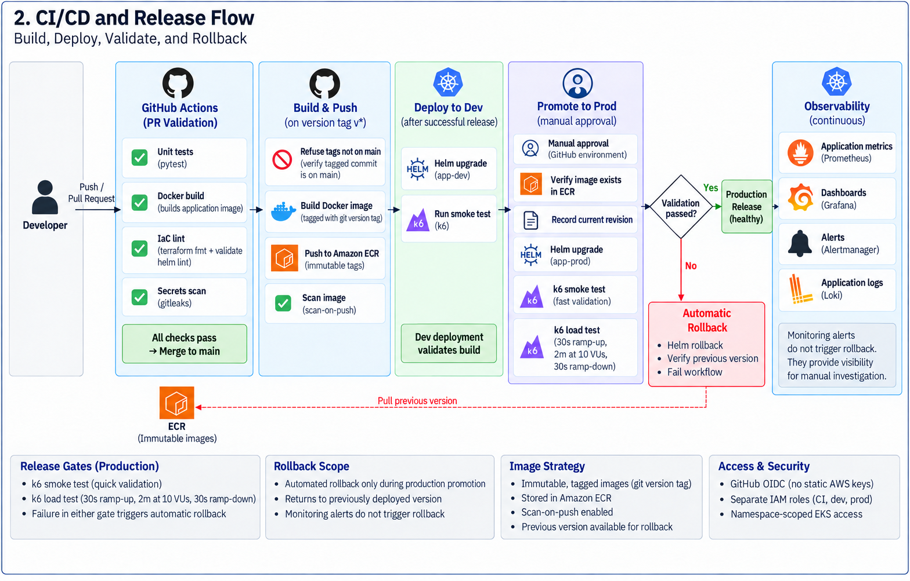

# EKS Observable Platform

An Amazon EKS-based Kubernetes reliability, observability, and application-delivery platform that demonstrates how workloads behave during failures and how production releases can be validated after deployment and automatically rolled back when validation fails.

The project started as a Kubernetes reliability lab using `podinfo` to test memory pressure, resource guardrails, application-level failures, monitoring, and planned node disruption. It was then extended with an owned application, Docker and ECR, Helm-based dev/prod environments, GitHub Actions, OIDC-based AWS access, application SLOs, k6 release gates, and automated rollback.

The result is a single project that covers both sides of operating workloads on Kubernetes: understanding how the platform behaves when something fails, and building a delivery path that can detect and reject a broken release.

## Project Goals

- Provision the AWS foundation with **Terraform**, including the VPC, Amazon EKS, managed node group, ECR, IAM roles, GitHub OIDC provider, and EKS access entries
- Deploy Kubernetes workloads with **Helm**, using separate development and production configuration, health probes, resource limits, PDBs, ServiceMonitors, and ALB ingress
- Build a complete **GitHub Actions CI/CD pipeline** covering pull-request validation, versioned releases, automatic dev deployment, manual production promotion, and post-deploy validation
- Use **GitHub Actions OIDC** and separate CI/dev/prod IAM roles so deployments use short-lived AWS credentials instead of stored access keys
- Store immutable application images in **Amazon ECR** and promote the same tested image from development to production
- Validate releases with **k6 smoke and load tests** after deployment instead of relying only on Kubernetes rollout health
- Harden production promotion by **serializing concurrent promotions**, restoring the **recorded healthy Helm revision** when validation fails, and removing a failed first release when no previous production revision exists
- Build a full **observability stack with Prometheus, Grafana, Alertmanager, Loki, and Promtail** for infrastructure, Kubernetes, container, application, and log visibility
- Expose custom application metrics for **success ratio, HTTP errors, latency, deployed version, and fault mode**, and use them in dashboards and Prometheus alerts
- Test the platform through controlled incidents covering **memory pressure, OOM and eviction, resource guardrails, HTTP 500 failures, node drain, release failure, and automated recovery**

## What Was Built

| Area | Implementation |
|---|---|
| Infrastructure | VPC, public subnets, EKS cluster, managed node group, IAM, ECR, GitHub OIDC provider, and EKS Access Entries provisioned with Terraform |
| Reliability foundation | Two-replica `podinfo` workload with resource guardrails, ALB ingress, monitoring, k6 traffic, and controlled failure tests |
| Owned application | Python/Flask application with health, readiness, version, and Prometheus metric endpoints |
| Application delivery | Docker, immutable ECR images, Helm dev/prod configuration, GitHub Actions, release validation, and automated rollback |
| Access control | Separate CI/dev/prod IAM roles, GitHub Actions OIDC, namespace-scoped EKS access, and Kubernetes RBAC |
| Container hardening | Non-root execution, no privilege escalation, read-only root filesystem, dropped Linux capabilities, and writable `/tmp` only |
| Observability | Prometheus, Grafana, Alertmanager, Loki, Promtail, kube-state-metrics, node-exporter, cAdvisor, application metrics, dashboards, and alerts |
| Testing | Separate k6 tests for the original `podinfo` workload and application smoke/load release gates |
| Operations | Makefile targets for infrastructure, setup, deployment, testing, chaos scenarios, verification, and ordered teardown |
| Failure evidence | Five incident reports covering memory failure, guardrails, HTTP errors, node drain, and automated rollback |

## How the Project Evolved

The platform was built in two stages.

### Phase 1 — Kubernetes Reliability and Observability

The first stage used `podinfo` as a known sample application so the tests could focus on Kubernetes behaviour.

1. **Establish the memory-failure baseline**  
   An unbounded workload attempted to allocate 6 GiB. Separate runs produced both container `OOMKilled` and kubelet `Evicted` outcomes.

2. **Add resource guardrails and monitoring**  
   Requests, limits, `LimitRange`, `ResourceQuota`, and alerting were added. Repeated memory failures stayed within the workload boundary, while Grafana and Prometheus exposed the restart activity.

3. **Test application health beyond Kubernetes health**  
   HTTP 500 responses were injected while the pods remained `Running` and `Ready`. Application metrics detected the user-facing failure even though Kubernetes health signals remained normal.

4. **Test planned disruption under load**  
   A worker node was drained while traffic continued. The `PodDisruptionBudget` prevented both replicas from being disrupted together.

### Phase 2 — Application Delivery, SLOs, and Recovery

The second stage added an owned application and a release path around the same EKS platform.

- The application is containerized with Docker and exposes `/healthz`, `/readyz`, `/version`, and `/metrics`
- Version tags create immutable ECR images containing the application version and Git commit
- Development and production use the same image with separate Helm values
- Pull requests run tests, Docker build validation, Terraform validation, Helm lint, and Gitleaks
- Tagged releases are published to ECR through GitHub Actions using OIDC
- Successful releases deploy automatically to `app-dev` and run a k6 smoke test
- Production promotion is manual and protected by the GitHub `production` environment
- Production runs smoke and load validation after the Helm rollout
- Production promotions are serialized so two workflows cannot modify `app-prod` at the same time
- Failed validation restores the recorded healthy Helm revision; if the first production release fails, the failed release is removed because no rollback target exists
- Prometheus and Grafana track success ratio, HTTP errors, latency, deployed version, and fault mode
- Incident 05 deliberately promoted a bad production configuration and verified detection, alerting, and automated rollback

## What the Experiments Demonstrated

- An unbounded memory workload can end in either `OOMKilled` or kubelet eviction depending on which protection reacts first
- Resource limits can contain a memory failure before it consumes the worker node
- A pod can remain `Running` and `Ready` while the application serves failed responses
- Application metrics are needed for failures that Kubernetes object health cannot see
- Per-replica request metrics can reveal healthy pods that receive little or no live traffic
- A `PodDisruptionBudget` protects availability during voluntary disruption
- A successful Kubernetes rollout does not guarantee correct application behaviour
- Post-deploy gates can reject a release after the rollout itself succeeds
- HTTP status and SLO metrics can expose a broken release even when latency remains normal
- Build-info metrics make the running application version visible during release investigation
- Monitoring provides continuous detection, while the deployment workflow can act immediately during a production promotion

## Architecture

### Platform Architecture


Two public ALBs are used: one for the original `podinfo` workload and one for `app-prod`. `app-dev` remains internal to the cluster.

The VPC contains two public subnets across two Availability Zones for EKS. The managed worker node group runs in one public subnet to keep the lab small and cost-controlled.

### Release and Rollback Flow



The diagram shows the normal recovery branch as a Helm rollback. The current workflow also covers two promotion edge cases: production promotions are serialized so two workflows cannot modify `app-prod` concurrently, and a failed first-ever production release is uninstalled because no previous Helm revision exists to restore.

The same versioned image is promoted rather than rebuilt for production. Continuous monitoring observes the application after deployment, while automated rollback is owned by the production promotion workflow when its validation gates fail.

## Platform Design

| Component | Configuration |
|---|---|
| AWS region | `ap-south-2` |
| Terraform backend | S3 remote state with native S3 locking, Terraform `1.10+` |
| VPC | `10.0.0.0/16`, two public subnets across two AZs |
| EKS node group | `m7i-flex.large`, desired/minimum `1`, maximum `2`, running in one public subnet |
| Container registry | ECR with immutable tags, scan-on-push, and untagged-image cleanup |
| Reliability workload | `podinfo`, two replicas in `manual-managed` |
| Development | `app-dev`, one replica, internal service |
| Production | `app-prod`, two replicas, public ALB ingress |
| Application resources | CPU request `50m`, memory request `64Mi`, CPU limit `500m`, memory limit `256Mi` |
| Monitoring | Prometheus, Grafana, Alertmanager, Loki, Promtail |
| CI/CD authentication | GitHub Actions OIDC with separate CI, dev-deploy, and prod-deploy roles |

## Kubernetes Reliability Foundation

The original `podinfo` workload remains in the repository because it provides the failure-testing foundation for Incidents 01–04.

The workload declares:

```yaml
resources:
  requests:
    cpu: 50m
    memory: 64Mi
  limits:
    cpu: 500m
    memory: 256Mi
```

The namespace also includes:

- `LimitRange` defaults and a maximum container memory limit of `512Mi`
- `ResourceQuota` for namespace-level resource control
- `PodDisruptionBudget` with `minAvailable: 1`

The original k6 workload runs in the separate `k6-testing` namespace so load generation does not interfere with the application namespace limits.

## Owned Application and Helm

The second phase uses an owned Flask application.

| Endpoint | Purpose |
|---|---|
| `/` | Main request path used by release validation |
| `/healthz` | Liveness check |
| `/readyz` | Readiness check |
| `/version` | Application version, Git commit, and environment |
| `/metrics` | Prometheus metrics |

The Helm deployment adds rolling updates, startup/liveness/readiness probes, explicit resources, a production PDB, `ServiceMonitor`, and production ALB ingress.

The container is also hardened through:

- `runAsNonRoot: true`
- `runAsUser: 1000`
- `allowPrivilegeEscalation: false`
- `readOnlyRootFilesystem: true`
- all Linux capabilities dropped
- an `emptyDir` mounted only at `/tmp`

Development runs one replica. Production runs two.

## CI/CD with GitHub Actions

Application delivery is automated through GitHub Actions, while Terraform infrastructure changes remain manual.

The pipeline is split into four workflows so pull-request validation, release creation, development deployment, and production promotion each have a clear responsibility.

| Workflow | What It Does |
|---|---|
| `pull-request.yml` | Runs unit tests, verifies the Docker build, validates Terraform and Helm, and scans the repository with Gitleaks |
| `release.yml` | Accepts version tags only from commits on `main`, builds the application image, and pushes the versioned image to Amazon ECR |
| `deploy-dev.yml` | Runs after a successful release, deploys the same image to `app-dev` with Helm, and runs a k6 smoke test |
| `promote.yml` | Manually promotes an existing ECR image to `app-prod`, serializes production changes, validates the release, and automatically restores or cleans up a failed release |

### Pull Request Validation

Every pull request must pass four GitHub Actions jobs before the change is merged:

- **Test** — runs the Python unit tests with `pytest`
- **Build** — confirms that the application Docker image builds successfully
- **Lint** — runs `terraform fmt`, `terraform validate`, and `helm lint`
- **Secrets** — scans the repository with Gitleaks

After the change reaches `main`, a version tag is used to create a release.

The release workflow first verifies that the tagged commit belongs to `main`. It then builds the Docker image, tags it with the Git version tag, and pushes it to an ECR repository configured with immutable tags and scan-on-push.

### Development Deployment

A successful release automatically triggers deployment to `app-dev`.

Helm deploys the versioned image and k6 runs a smoke test against the development application. This provides an application-level check before the same image is considered for production.

The image is not rebuilt for production. The exact image already published and tested in development is promoted forward.

### Production Promotion

Production deployment is intentionally separate from development.

Promotion requires manual approval through the GitHub `production` environment. A workflow-level concurrency group allows only one `app-prod` promotion to run at a time, so a second manual promotion waits rather than racing the active Helm deployment or its validation gates.

After approval, the workflow:

1. assumes the production deployment role through GitHub OIDC
2. verifies that the requested image exists in ECR
3. records whether `app-prod` already exists and, when it does, its current healthy Helm revision
4. deploys the selected version to `app-prod` with Helm
5. runs the production k6 smoke test
6. runs the sustained k6 load test if smoke validation passes

GitHub Actions uses short-lived AWS credentials through OIDC, so long-lived AWS access keys are not stored in repository secrets.

Terraform creates separate roles for CI, development deployment, and production deployment. EKS Access Entries scope the deployment roles to the required namespaces, while Kubernetes RBAC grants the additional `ServiceMonitor` permissions needed by the monitoring CRD.

## Release Validation and Automated Rollback

A successful Kubernetes rollout is not treated as proof that the application is working correctly.

Helm deploys production with:

```text
--atomic --wait --timeout 5m
```

This protects the release when Kubernetes cannot complete the rollout, for example when new pods cannot become Ready.

After the rollout succeeds, the application is validated separately with k6.

### Smoke Gate

The smoke test runs five virtual users for 20 seconds and requires:

```text
HTTP failures = 0%
p95 latency < 500 ms
```

### Load Gate

Only a successful smoke test proceeds to the three-minute load test:

```text
30s ramp-up to 10 VUs
2m hold at 10 VUs
30s ramp-down
```

The load gate requires:

```text
HTTP failures < 1%
p95 latency < 1 s
```

Smoke runs first so a fundamentally broken release fails quickly instead of waiting through the full load profile.

If either production validation gate fails and a healthy production release existed before deployment, GitHub Actions explicitly runs `helm rollback` against the revision recorded before the promotion. The rollback creates a new Helm revision whose state matches that known-good revision.

The first-ever production deployment is handled separately. If its validation fails, there is no earlier revision to restore, so the workflow uninstalls the failed `app-prod` release instead of attempting an invalid rollback.

The production promotion workflow uses a concurrency group with `cancel-in-progress: false`, which ensures only one promotion can modify `app-prod` at a time. This keeps the recorded rollback target deterministic throughout deployment and validation.

In both cases the GitHub Actions workflow remains failed, so the rejected promotion stays visible in CI/CD history.

### Promotion Edge Cases Covered

The production workflow explicitly handles the main states around deployment and recovery:

| Situation | Behaviour |
|---|---|
| Rollout cannot become healthy | Helm `--atomic --wait` owns the failure and reverts the rollout |
| Rollout succeeds but smoke/load validation fails | GitHub Actions restores the exact healthy Helm revision recorded before deployment |
| First-ever production release fails validation | No previous revision exists, so the failed `app-prod` release is uninstalled |
| Two production promotions are triggered close together | The `app-prod-promotion` concurrency group allows only one to run; the later promotion waits |
| Runtime alert fires outside a promotion | Prometheus/Alertmanager provide detection only; monitoring alerts do not trigger rollback |


Incident 05 validated this path by promoting a production configuration that caused HTTP 500 responses. Kubernetes and Helm completed the rollout successfully, but the smoke test detected the application failure and triggered rollback to the previous healthy release.

Helm history preserved both the failed upgrade and the rollback revision, while the application returned to its previous healthy version.

The current workflow keeps the same recovery model but hardens it further by serializing production promotions and passing the recorded healthy revision explicitly to `helm rollback`. It also handles a failed first-ever production deployment by uninstalling that failed release when no previous revision exists.

## Observability

The platform combines Kubernetes, infrastructure, container, application, and log signals instead of relying on pod status alone.

Prometheus collects metrics from several sources:

| Source | What It Provides |
|---|---|
| `kube-state-metrics` | Kubernetes object state, replica status, and container restart counters |
| `node-exporter` | Worker-node CPU, memory, filesystem, and network metrics |
| kubelet / cAdvisor | Pod and container resource usage |
| `podinfo` metrics | Request rate, response status, and latency used during the Phase 1 experiments |
| owned application metrics | Request count, latency, build information, and runtime fault state |

The pre-built dashboards from `kube-prometheus-stack` provide node and container visibility, while the custom dashboards focus on workload and application behaviour.

The owned application exports:

- `app_requests_total`
- `app_request_latency_seconds`
- `app_build_info`
- `app_fault_mode`

`app_build_info` makes the running application version, Git commit, and environment visible in Grafana. This allowed the Incident 05 failure to be correlated directly with the `v1.8.0` release.

### Application SLO Dashboard

The custom Grafana dashboard tracks:

- success ratio
- HTTP 5xx error rate
- request rate
- p95 latency
- deployed version
- fault-mode state

This provides both user-facing health and release context on the same dashboard.


### Alerting

Prometheus evaluates application-specific alert rules:

| Alert | Detects |
|---|---|
| `AppHighErrorRate` | More than 1% of requests failing for 2 minutes |
| `AppHighLatency` | p95 application latency above 1 second for 5 minutes |
| `AppFaultModeEnabled` | Fault mode remaining enabled for 1 minute |
| `AppPodRestarting` | Recent container restart activity |

During Incident 05, the application error-rate alert moved to `Firing` as the success ratio collapsed:


Prometheus alert history also showed `AppFaultModeEnabled` moving through `Pending` and into `Firing` while the bad production configuration was active:


These signals serve a different purpose from the deployment gates. Prometheus and Alertmanager continuously detect runtime problems, while GitHub Actions owns automated rollback only during an active production promotion.

### Logging

Loki and Promtail collect container logs across the cluster.

During the HTTP fault-injection experiment, application metrics provided the main failure signal while Loki confirmed that the logging pipeline was working and captured the logs emitted by the application.

When an application emits detailed request or error logs, the same Loki pipeline can provide additional context for investigating the cause behind a metric or alert.

Grafana's admin password is not hardcoded in Helm values. The chart generates it in a Kubernetes Secret, and the Makefile/runbook retrieve it when access is needed.

## Failure Experiments and Results

| Incident | Test | Result |
|---|---|---|
| [01 — Unbounded Pod Memory Failure](incidents/incident-01/unbounded-pod-memory-failure.md) | A pod attempted to allocate 6 GiB without requests or limits | Separate runs produced both `OOMKilled` and kubelet `Evicted` outcomes |
| [02 — Guardrails and Monitoring](incidents/incident-02/guardrails-and-monitoring.md) | The memory workload was repeated as a Deployment with namespace policies and monitoring | The failure stayed within the workload boundary, Grafana showed repeated restarts, and the alert moved to `Firing` |
| [03 — Healthy Pods Serving HTTP 500](incidents/incident-03/healthy-pods-serving-errors.md) | Fault injection returned HTTP 500 while probes remained healthy | Application metrics detected the failure while Kubernetes still showed the pods as `Running` and `Ready` |
| [04 — Node Drain Under Load](incidents/incident-04/node-drain-under-load.md) | The original worker node was drained while k6 traffic continued | The PDB prevented both replicas from being disrupted together and the workload moved to the second node |
| [05 — Broken Release and Automated Rollback](incidents/incident-05/automated-rollback.md) | A production-specific configuration caused a successful rollout to serve HTTP 500 responses | SLO and error metrics exposed the failure, the smoke gate failed, alerts fired, and the workflow rolled production back |

Together, the incidents cover workload isolation, node pressure, application correctness, disruption handling, release validation, observability, and automated recovery.

## Intentional Scope

This is a hands-on portfolio platform rather than a production reference architecture.

- Terraform infrastructure provisioning and teardown remain manual; GitHub Actions automates application delivery
- Automated rollback is limited to the production promotion workflow when a k6 smoke or load gate fails
- Prometheus, Grafana, and Alertmanager continuously detect runtime failures, but monitoring alerts do not trigger rollback automatically
- Worker nodes use public subnets and the node group normally runs one worker to keep the lab cost controlled
- Grafana and Loki use non-persistent storage for this lab
- Kubernetes NetworkPolicies were evaluated but not added to the current public-subnet design. With ALB IP targets, permitting ingress from the load balancer would require allowing the relevant subnet address range, which would also make the policy broad. A private-node design would provide a cleaner network boundary, but this lab intentionally uses public worker nodes to avoid NAT Gateway cost
- External Secrets Operator was also evaluated and scoped out. The project has no application secret-management requirement that justifies running an additional operator; the Grafana admin password was removed from Helm values and is chart-generated in a Kubernetes Secret instead

## Makefile and Operations

The Makefile wraps the commands used most often:

| Command | Purpose |
|---|---|
| `make init` | Initialize the Terraform working directory (required once per clone) |
| `make apply` | Create the cluster and supporting AWS resources |
| `make platform` | Deploy `podinfo`, guardrails, Metrics Server, namespaces, and RBAC |
| `make monitoring` | Install monitoring and apply dashboards and alert rules |
| `make app-dev TAG=vX.Y.Z` / `make app-prod TAG=vX.Y.Z` | Manual application deployment |
| `make test` | Run application unit tests |
| `make lint` | Run Terraform and Helm validation used by CI |
| `make smoke` / `make load` | Run application release gates |
| `make chaos-oom` / `make chaos-drain` | Re-run the main reliability scenarios |
| `make chaos-drain-revert` | Uncordon the node `chaos-drain` drained, before scaling it back down |
| `make destroy` | Ordered teardown of ALBs, controller resources, and Terraform infrastructure |

The teardown order matters because the AWS Load Balancer Controller creates ALBs outside Terraform's direct resource graph. The Makefile removes ingress owners and waits for the load balancers to disappear before destroying the EKS/VPC infrastructure.

## Repository Structure

```text
.
├── .github/
│   └── workflows/
│       ├── deploy-dev.yml
│       ├── promote.yml
│       ├── pull-request.yml
│       └── release.yml
├── application/
│   ├── helm/
│   │   ├── templates/
│   │   │   ├── deployment.yaml
│   │   │   ├── ingress.yaml
│   │   │   ├── pdb.yaml
│   │   │   ├── service.yaml
│   │   │   └── servicemonitor.yaml
│   │   ├── Chart.yaml
│   │   ├── values-dev.yaml
│   │   ├── values-prod.yaml
│   │   └── values.yaml
│   ├── app.py
│   ├── Dockerfile
│   ├── requirements-dev.txt
│   ├── requirements.txt
│   └── test_app.py
├── docs/
│   ├── eks-observable-platform-architecture.png
│   ├── release-and-rollback-flow.png
│   └── runbook.md
├── incidents/
│   ├── incident-01/
│   ├── incident-02/
│   ├── incident-03/
│   ├── incident-04/
│   └── incident-05/
├── k6/
│   ├── app/
│   │   ├── load-job.yaml
│   │   ├── load.js
│   │   ├── smoke-job.yaml
│   │   └── smoke.js
│   └── podinfo/
│       ├── k6-job.yaml
│       └── load-test.js
├── k8s/
│   ├── chaos/
│   ├── manual/
│   └── rbac/
├── observability/
│   ├── grafana-dashboards/
│   │   ├── app-slo-dashboard.json
│   │   └── podinfo-dashboard.json
│   ├── app-alert-rules.yaml
│   ├── grafana-dashboard-configmap.yaml
│   ├── kube-prom-stack-values.yaml
│   ├── loki-values.yaml
│   ├── podinfo-alert-rules.yaml
│   └── podinfo-servicemonitor.yaml
├── scripts/
│   └── wait-for-job.sh
├── terraform/
│   ├── .terraform.lock.hcl
│   ├── backend.tf
│   ├── ecr.tf
│   ├── eks-access.tf
│   ├── eks.tf
│   ├── iam-ci.tf
│   ├── iam-deploy.tf
│   ├── main.tf
│   ├── oidc.tf
│   └── vpc.tf
├── .gitignore
├── Makefile
└── README.md
```

## Prerequisites

- AWS account and configured AWS CLI credentials for infrastructure administration
- Terraform `1.10+`
- `kubectl`
- Helm
- `eksctl`
- Docker
- Python / `pytest`
- GNU Make
- `jq`
- GitHub repository with the `production` environment approval configured

## Installation and Operations

The complete infrastructure setup, rebuild process, observability installation, ingress-controller setup, manual application deployment, rollback commands, load tests, chaos scenarios, Grafana access, and ordered teardown are documented in [docs/runbook.md](docs/runbook.md).

Normal application delivery is handled through GitHub Actions. Terraform infrastructure remains intentionally manual.

## Lab Notes

- The final production Helm values keep fault mode disabled; it was enabled only during the controlled Incident 05 experiment
- Loki persistence is disabled, so logs do not survive a Loki rebuild
- Grafana has no persistent volume; its admin password is chart-generated and the application SLO dashboard is provisioned from a ConfigMap
- The older `podinfo` dashboard is imported manually after a rebuild
