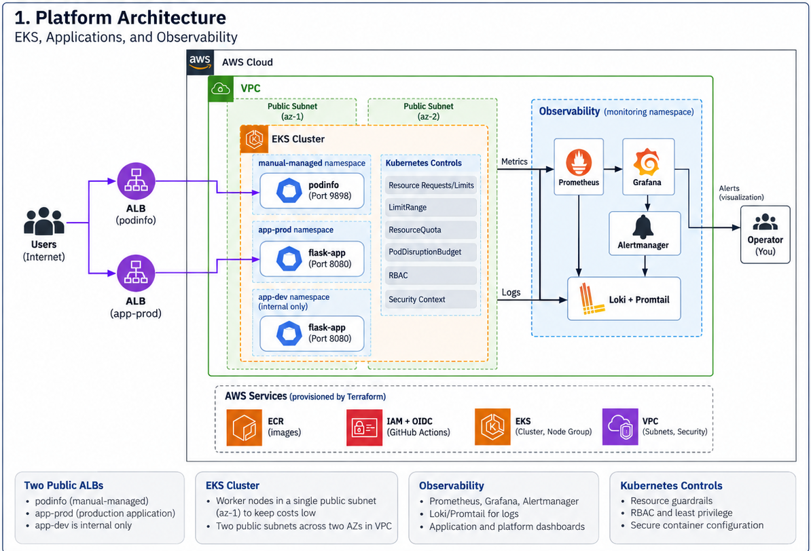
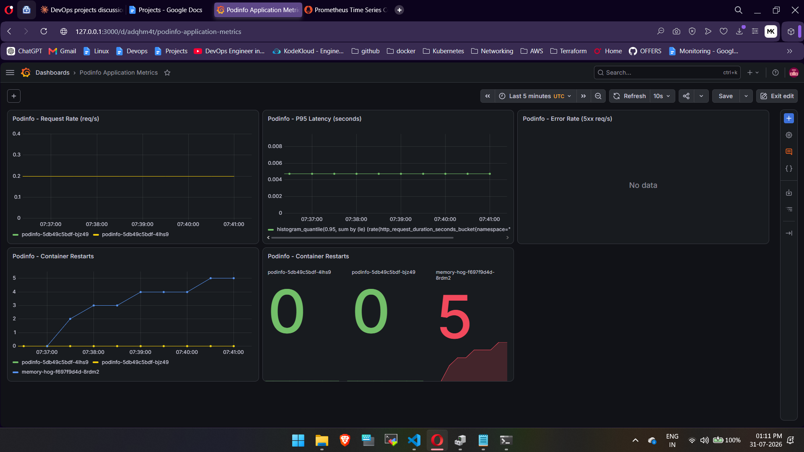
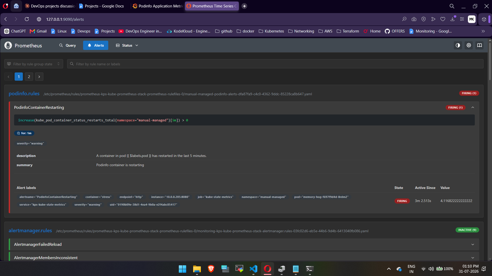
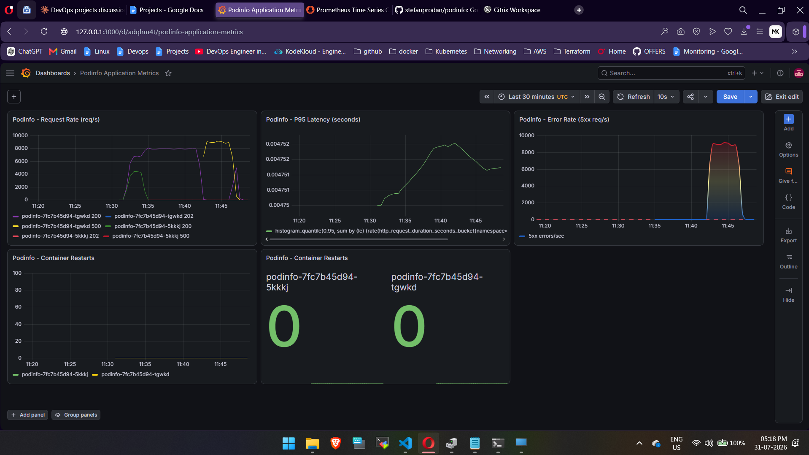

# EKS Observable Platform

An Amazon EKS-based Kubernetes reliability and observability platform that demonstrates how workloads behave during real failures.

The platform runs the podinfo application behind an AWS Application Load Balancer, applies Kubernetes resource guardrails, generates traffic with k6, and uses Prometheus, Grafana, Alertmanager, Loki, and Promtail to observe infrastructure, container, Kubernetes, and application behaviour.

The tests cover memory exhaustion, repeated container restarts, HTTP errors from pods that still appear healthy, and worker-node drain while traffic continues, showing how metrics, logs, events, dashboards, and alerts work together during troubleshooting.

## Project Goals

- Provision a repeatable EKS environment with Terraform
- Deploy a two-replica application through an AWS Application Load Balancer
- Protect workloads with requests, limits, `LimitRange`, `ResourceQuota`, and a `PodDisruptionBudget`
- Collect node, container, Kubernetes object, application, and log data
- Generate continuous traffic with k6 while failures are introduced
- Use dashboards, alerts, events, and logs to investigate each failure
- Document the observations, root cause, recovery, and lessons from every test

## What Was Built

| Area | Implementation |
|---|---|
| Infrastructure | VPC, public subnets, IAM roles, EKS cluster, and managed node group provisioned with Terraform |
| Application | Two `podinfo` replicas running in the `manual-managed` namespace |
| Traffic entry | AWS Load Balancer Controller with an Application Load Balancer in IP target mode |
| Resource protection | CPU and memory requests and limits, `LimitRange`, `ResourceQuota`, and `PodDisruptionBudget` |
| Observability | Prometheus, Grafana, Alertmanager, Loki, Promtail, kube-state-metrics, node-exporter, and cAdvisor |
| Application monitoring | `podinfo` metrics collected through a `ServiceMonitor` |
| Load generation | k6 running from the separate `k6-testing` namespace |
| Failure testing | Memory pressure, container OOM, kubelet eviction, HTTP 500 injection, and node drain |

## How the Project Evolved

The platform was developed through four controlled experiments:

1. **Establish the failure baseline**  
   A pod without resource requests or limits attempted to allocate 6 GiB. Separate runs produced a container `OOMKilled` result and a kubelet `Evicted` result.

2. **Add guardrails and alerting**  
   Namespace policies and container limits were added. The same memory workload then failed inside its own cgroup boundary, while the node and application replicas remained stable. Prometheus detected the repeated restarts and moved the alert to `Firing`.

3. **Test application health beyond Kubernetes health**  
   HTTP 500 responses were injected while both `podinfo` replicas remained `Running` and `Ready`. Kubernetes health checks did not identify the user-facing failure, but application metrics showed it immediately.

4. **Test planned disruption under load**  
   A second worker node was added and the original node was drained while k6 traffic continued. The `PodDisruptionBudget` prevented both replicas from being disrupted together and allowed them to move one at a time.

## What the Experiments Demonstrated

- `OOMKilled` and kubelet eviction are different failure paths
- Resource limits can contain a memory failure before it consumes the node
- A pod can remain `Running` and `Ready` while the application serves errors
- Application metrics are required for failures that Kubernetes object health cannot see
- Connection reuse can hide a failing replica during load testing
- A `PodDisruptionBudget` protects availability during voluntary disruptions
- Metrics, logs, events, dashboards, and alerts provide different parts of the same incident story

## Architecture




Terraform manages the AWS network, IAM roles, EKS cluster, and managed node group. Kubernetes manifests and Helm manage the application, policies, ingress controller, and observability components.

## Platform Design

| Component | Configuration |
|---|---|
| AWS region | `ap-south-2` |
| VPC | `10.0.0.0/16` |
| Subnets | Two public subnets across two Availability Zones |
| EKS node group | `m7i-flex.large`, desired `1`, maximum `2` |
| Application | `podinfo:6.14.1`, two replicas |
| Application namespace | `manual-managed` |
| Load-test namespace | `k6-testing` |
| Ingress | AWS Load Balancer Controller, IP target mode |
| Monitoring | Prometheus, Grafana, Alertmanager, Loki, Promtail |
| Load testing | k6, three virtual users |

The second node is used for the planned node-drain test. The default cluster remains small to keep the lab cost controlled.

## Resource Guardrails

The application declares:

```yaml
resources:
  requests:
    cpu: 50m
    memory: 64Mi
  limits:
    cpu: 500m
    memory: 256Mi
```

The namespace also includes:

- A `LimitRange` that injects default requests and limits
- A maximum container memory limit of `512Mi`
- A `ResourceQuota` that caps total namespace consumption
- A `PodDisruptionBudget` with `minAvailable: 1`

These controls were added and tested after the first memory-pressure incident.

## Observability

Prometheus collects metrics from four main sources:

| Source | Purpose |
|---|---|
| `kube-state-metrics` | Kubernetes object state, pod status, deployments, and restart counters |
| `node-exporter` | Node CPU, memory, filesystem, and network metrics |
| kubelet / cAdvisor | Pod and container resource metrics |
| `podinfo` metrics | Request rate, response status, and application latency |

All four sources are collected. The pre-built dashboards shipped with `kube-prometheus-stack` provide node and container views from `node-exporter` and cAdvisor.

The custom dashboards and alert in this project use `kube-state-metrics` and the application's own metrics.

Loki and Promtail collect container logs. Metrics show when and how much a service is failing, while logs can provide the detailed context needed to understand why.

### Monitoring Screenshots

**Grafana — container restarts and application metrics**



**Prometheus — restart alert firing**



**Grafana — application error monitoring during fault injection**



## Failure Experiments and Results

| Incident | Test | Result |
|---|---|---|
| [01 — Unbounded Pod Memory Failure](incidents/incident-01/unbounded-pod-memory-failure.md) | A pod attempted to allocate 6 GiB without requests or limits | Produced both `OOMKilled` and kubelet `Evicted` outcomes across two runs |
| [02 — Guardrails and Monitoring](incidents/incident-02/guardrails-and-monitoring.md) | The same memory test was repeated with namespace policies and alerting | Failure stayed inside one container and the restart alert moved to `Firing` |
| [03 — Healthy Pods Serving Errors](incidents/incident-03/healthy-pods-serving-errors.md) | Fault injection returned HTTP 500 while probes remained healthy | Application metrics detected the failure while Kubernetes still showed `Running` and `Ready` |
| [04 — Node Drain Under Load](incidents/incident-04/node-drain-under-load.md) | The original node was drained while k6 traffic continued | The PDB moved replicas one at a time and k6 recorded zero interrupted iterations |

Together, the incidents show why infrastructure health, Kubernetes state, application metrics, logs, alerts, and workload policies are all needed.

## Repository Structure

```text
.
├── README.md
├── backend.tf
├── docs/
│   ├── eks-observable-platform-architecture.png
│   └── runbook.md
├── eks.tf
├── incidents/
│   ├── incident-01/
│   │   ├── logs/
│   │   │   ├── runA.txt
│   │   │   └── runB.txt
│   │   └── unbounded-pod-memory-failure.md
│   ├── incident-02/
│   │   ├── grafana-dashboard.png
│   │   ├── guardrails-and-monitoring.md
│   │   ├── logs/
│   │   │   └── guardrail-test.txt
│   │   └── prometheus-alert.png
│   ├── incident-03/
│   │   ├── grafana-monitoring.png
│   │   ├── healthy-pods-serving-errors.md
│   │   └── logs/
│   │       └── fault-injection.txt
│   └── incident-04/
│       ├── logs/
│       │   └── node-drain.txt
│       └── node-drain-under-load.md
├── k6/
│   ├── k6-job.yaml
│   └── load-test.js
├── k8s/
│   ├── chaos/
│   │   ├── memory-hog-deployment.yaml
│   │   ├── memory-hog-limited.yaml
│   │   └── memory-hog-unbounded.yaml
│   └── manual/
│       ├── deployment-v1-no-limits.yaml
│       ├── deployment-v2-with-limits.yaml
│       ├── ingress.yaml
│       ├── limitrange.yaml
│       ├── pdb.yaml
│       ├── resourcequota.yaml
│       └── service.yaml
├── main.tf
├── observability/
│   ├── grafana-dashboards/
│   │   └── podinfo-dashboard.json
│   ├── kube-prom-stack-values.yaml
│   ├── loki-values.yaml
│   ├── podinfo-alert-rules.yaml
│   └── podinfo-servicemonitor.yaml
└── vpc.tf
```

## Prerequisites

- AWS account and configured AWS CLI credentials
- Terraform `1.10+`
- `kubectl`
- Helm
- `eksctl`

## Installation and Operations

The complete installation, rebuild, ingress, load-testing, and teardown steps are documented in [docs/runbook.md](docs/runbook.md).

## Lab Notes

- Worker nodes use public subnets to avoid NAT Gateway cost.
- The node group normally runs one node and temporarily scales to two for the drain test.
- Loki persistence is disabled.
- Grafana has no persistent volume, so the custom dashboard is imported again after a rebuild.
- This is a learning platform, not a production reference architecture.
