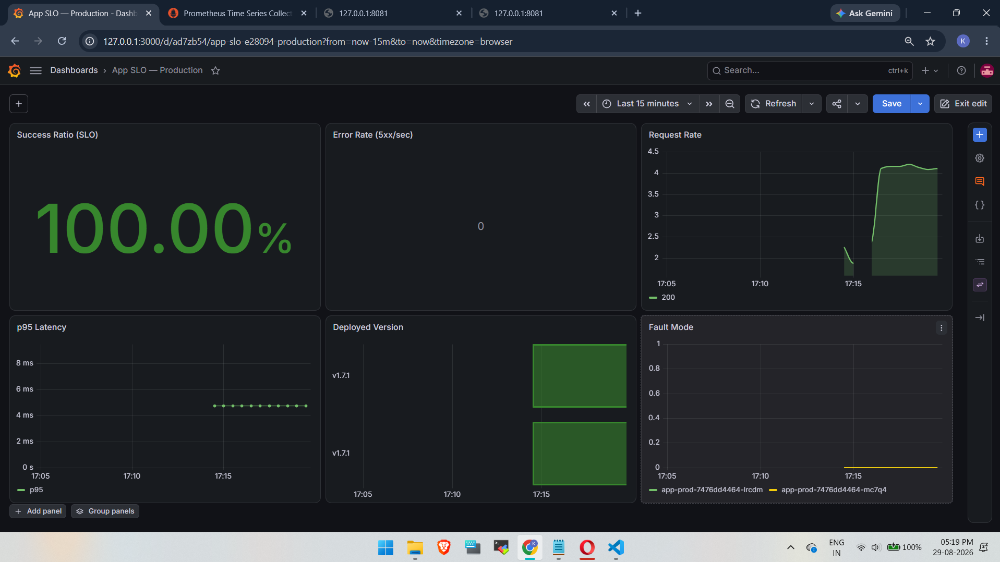
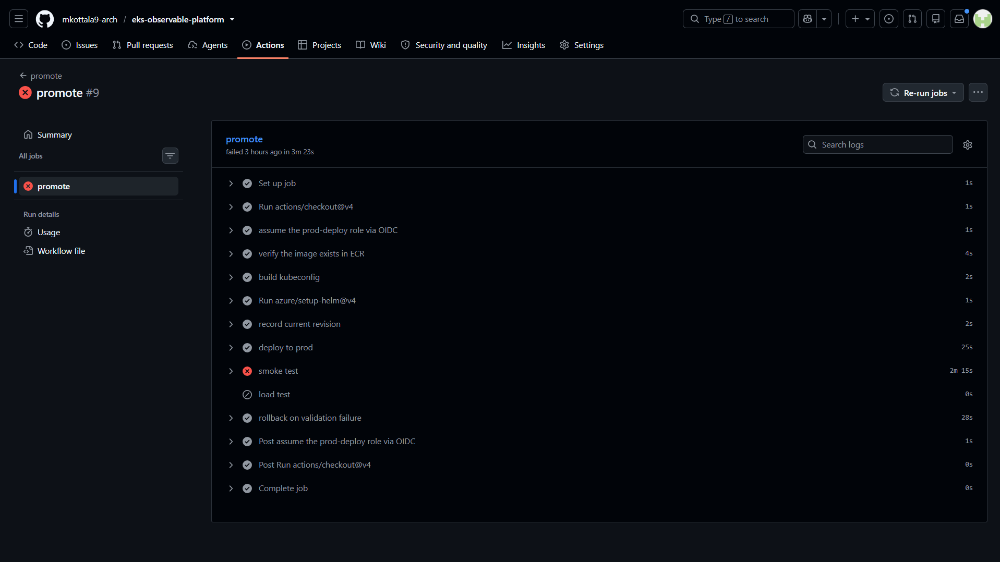
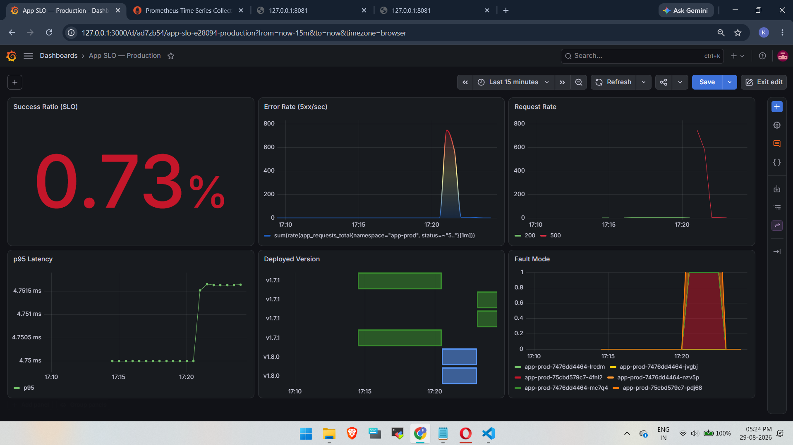
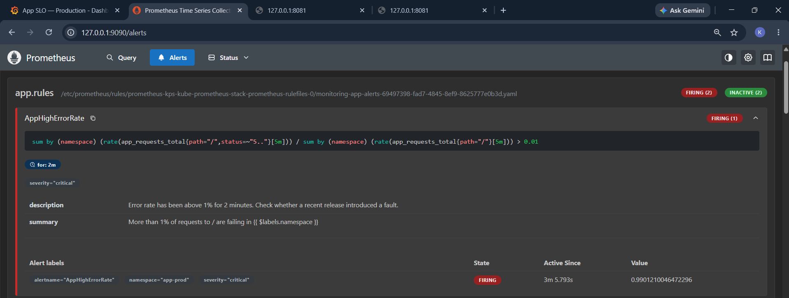
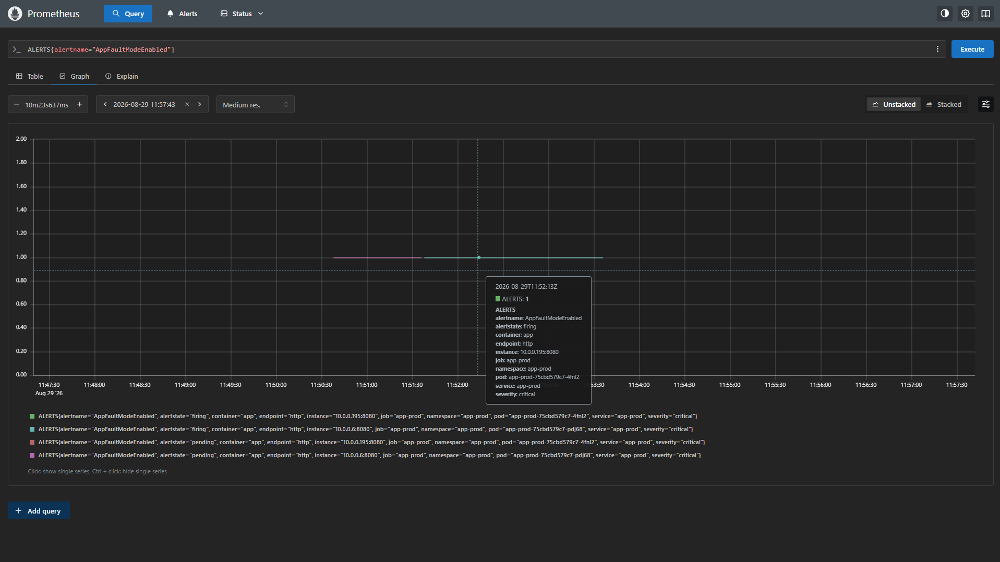
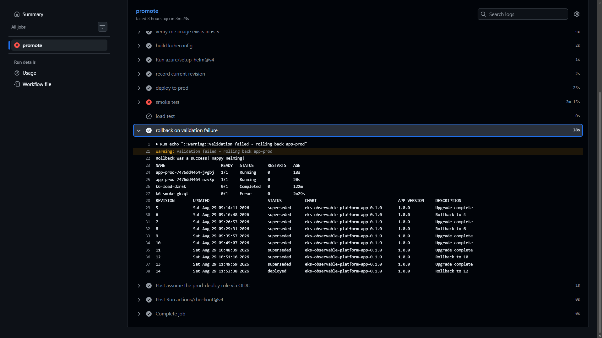
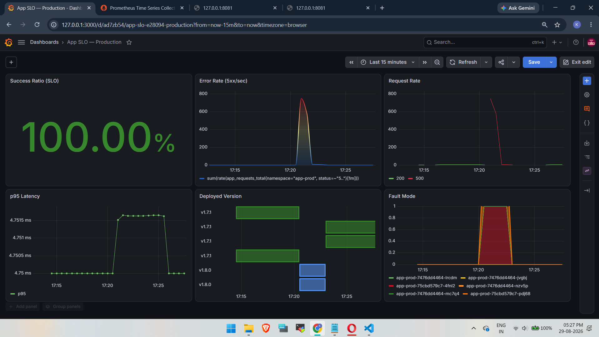
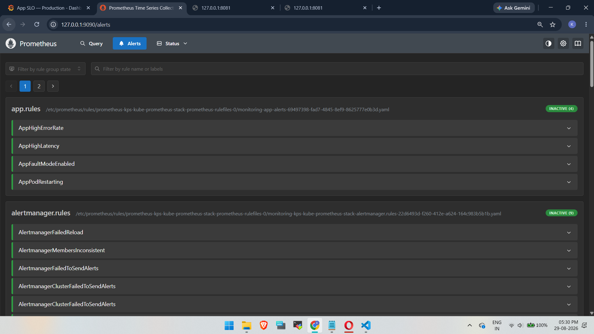

# Incident 05 — Broken Release and Automated Rollback

> **Scenario:** `app-prod`, the application deployed through the CI/CD pipeline, was promoted from `v1.7.1` to `v1.8.0`. The Kubernetes rollout completed successfully and the new pods remained healthy, but the production configuration caused almost all application requests to return HTTP 500. The post-deploy smoke test detected the failure and the pipeline automatically rolled production back to `v1.7.1`.

This test demonstrated the difference between a release that deploys successfully and a release that works correctly.

The failure was introduced through production configuration rather than application code. `values-prod.yaml` enabled `faultMode`, while the development configuration kept it disabled. The same application image could therefore remain healthy in development and fail after promotion when the production-specific values were applied.

---

## Test Setup

Production was already running `v1.7.1` in the `app-prod` namespace with two replicas.

The production Helm values were changed to enable fault mode:

```yaml
# helm/app/values-prod.yaml
faultMode: true
```

The existing delivery checks still passed:

- the YAML was valid
- the Helm chart rendered successfully
- the unit tests passed because the application code had not changed
- the development deployment remained healthy because `values-dev.yaml` kept `faultMode: false`

`v1.8.0` was then promoted to production using the same release artifact with the production-specific Helm values.

---

## Baseline

Production was healthy before the promotion:



The dashboard showed a `100%` success ratio, no HTTP 5xx errors, p95 latency around `4.7505 ms`, `v1.7.1` running on both replicas, and fault mode disabled.


---

## Promotion

The promotion workflow deployed `v1.8.0` to production.

Helm recorded revision `13` as an `Upgrade complete` at `11:49:59 UTC`.

The rollout itself completed successfully. The new pods started, passed their Kubernetes health checks, and the Deployment reached the expected replica count.

From Kubernetes and Helm's point of view, the release was healthy enough to complete the rollout.

The application behaviour was different. Once the production configuration enabled fault mode, the main request path began returning HTTP 500 responses.

---

## Post-Deploy Validation

After the deployment completed, the promotion workflow ran a k6-based smoke test against production.

The deployment step succeeded, but the smoke-test pod ended in `Error` and the workflow marked the **smoke test** step as failed. The separate load-test step was skipped because validation had already failed.



The workflow then executed **rollback on validation failure**, which completed successfully.

This was the important release gate in the test: deployment success alone did not make the promotion successful. The deployed application also had to pass a functional check.


---

## What the Dashboard Showed



After `v1.8.0` was promoted with fault mode enabled, the success ratio dropped to roughly `0.73%` and the HTTP 5xx rate peaked around `700–750 requests/sec`.

Request traffic continued while p95 latency remained almost unchanged at about `4.7515 ms`. The **Deployed Version** and **Fault Mode** panels tied the failure directly to the new release.


---

## Alerting Result

Prometheus detected the application failure through the HTTP error-rate alert:



`AppHighErrorRate` moved to `Firing` for `app-prod` as the HTTP 500 ratio increased. The captured value was approximately `0.99`, meaning roughly 99% of requests in the alert calculation were failing.

The application also exposed its fault-mode state as a metric. Prometheus alert history shows `AppFaultModeEnabled` moving through `Pending` and into `Firing` while the affected pods were running with fault mode enabled:



This provided a second application-level signal alongside the HTTP error-rate alert: one showed the user-facing impact, while the other identified that fault mode was active in the affected pods.

After rollback, the application alerts returned to `Inactive`.


---

## Automated Rollback

The failed smoke test triggered the rollback step.

The detailed GitHub Actions output shows both the recovery and the Helm history:



After rollback, the application pods were healthy again:

```text
NAME                         READY   STATUS      RESTARTS   AGE
app-prod-7476dd4464-jvgbj    1/1     Running     0          18s
app-prod-7476dd4464-nzv5p    1/1     Running     0          20s
k6-load-dzr5k                0/1     Completed   0          122m
k6-smoke-gkzqt               0/1     Error       0          2m29s
```

The Helm history captured in the same step shows the failed promotion and the new rollback revision. The excerpt below keeps the columns visible in the workflow output:

```text
REVISION   UPDATED                       STATUS       CHART                                APP VERSION   DESCRIPTION
12         Sat Aug 29 10:51:16 2026     superseded   eks-observable-platform-app-0.1.0    1.0.0         Rollback to 10
13         Sat Aug 29 11:49:59 2026     superseded   eks-observable-platform-app-0.1.0    1.0.0         Upgrade complete
14         Sat Aug 29 11:52:38 2026     deployed     eks-observable-platform-app-0.1.0    1.0.0         Rollback to 12
```

Revision `13` was the failed production promotion. The rollback did not delete it. Helm created revision `14`, which restored revision `12`.

The `APP VERSION` column remained `1.0.0` across these revisions because the application image version was supplied through Helm values rather than the chart `appVersion`. Helm history therefore showed that a rollback happened and which revision was restored, while the application's `app_build_info` metric provided the actual deployed version shown in Grafana (`v1.7.1` and `v1.8.0`).

Earlier rollback entries visible in the screenshot were from previous rehearsal runs of the same rollback workflow.

The GitHub Actions workflow itself remained failed. The rollback restored service, but the attempted promotion still did not pass validation.

---

## Recovery

After rollback, production returned to `v1.7.1`:



The success ratio returned to `100%`, HTTP 5xx errors returned to zero, p95 latency returned to about `4.7505 ms`, and fault mode returned to `0`.

The Fault Mode panel shows a clear `0 → 1 → 0` transition, while the Deployed Version panel shows the matching move from `v1.7.1` to `v1.8.0` and back to `v1.7.1`.

The Prometheus application alerts were also `Inactive` after recovery:




---

## Recovery Time

Helm history and Grafana independently line up on the same release window.

| Event | UTC | IST |
|---|---|---|
| `v1.8.0` upgrade recorded | `11:49:59` | `17:19:59` |
| Rollback revision recorded | `11:52:38` | `17:22:38` |

The interval between the recorded upgrade and rollback revisions was approximately `2m 39s`.

Grafana was using the browser timezone, so the Fault Mode panel changed from `0` to `1` at about `17:20 IST` and returned to `0` shortly before the rollback revision was recorded. The dashboard timing is consistent with the Helm history after converting UTC to IST.

The GitHub Actions view also shows the smoke-test step running for about `2m 15s` and the rollback step completing in about `28s`.

The two independent sources therefore corroborate the period in which the bad release was active and the point at which rollback restored the previous version.

---

## Finding 1 — Deployment Health and Application Health Were Different

The Kubernetes rollout completed successfully because the pods started and remained healthy from the platform's perspective.

That did not prove that the application was serving correct responses.

The problem became visible when the post-deploy smoke test exercised the application after rollout.

This extends the lesson from Incident 03 into the delivery pipeline: a pod can be `Running` and `Ready` while serving errors, and a release can be successfully deployed while the application itself is failing.

---

## Finding 2 — The Deployment Gate Could Act While the Release Was Still in Progress

The smoke test failed while the promotion workflow was still active.

Because the workflow had recorded the previous working Helm revision before deployment, the validation failure could immediately trigger rollback.

The `AppHighErrorRate` alert detected the same application failure through continuous monitoring, but its `for: 2m` condition intentionally required the failure to persist before firing.

The two mechanisms serve different purposes:

- the deployment gate validates a release immediately after deployment and can automatically reject it
- monitoring and alerting continue watching the application after the deployment workflow has finished

Together, they provide both release-time validation and continuous runtime detection.

---

## Finding 3 — Latency Was Not a Failure Signal

The p95 latency moved from approximately `4.7505 ms` to `4.7515 ms` while the success ratio collapsed and the HTTP 500 rate increased sharply.

The difference was only about one microsecond.

An application can return an error quickly. Latency measures how long a response takes, not whether the response is correct.

In this incident, success ratio and HTTP status metrics exposed the failure while latency remained effectively normal.

---

## Finding 4 — Production-Specific Configuration Needed Production Validation

The application image remained healthy in development because the development values kept fault mode disabled.

The failure appeared only when the production-specific values enabled it.

The earlier pipeline stages correctly validated the image and the development deployment. The post-deploy smoke test then validated the final production combination of application image and production configuration.

Additional configuration-policy checks or a production-like pre-production environment could move some validation earlier, but the post-deploy gate still provides value because it checks the application in the environment where the release is actually running.

---

## Finding 5 — Rollback Restored Service Without Hiding the Failed Promotion

The rollback succeeded, but the GitHub Actions job remained red.

That distinction is useful:

- rollback success means service was recovered
- workflow failure means the attempted release did not pass validation

Helm history also preserved the failed upgrade as revision `13` and recorded the recovery as revision `14`.

A successful recovery should restore service without making a broken promotion appear successful.

---

## Finding 6 — Build Information Made the Release Visible

Helm history recorded the chart revision and rollback sequence, but its `APP VERSION` column remained `1.0.0` for both the failed and recovered revisions.

The Grafana **Deployed Version** panel filled that gap by using the application's `app_build_info` metric to show the actual application version running in each pod.

That made the incident easier to correlate:

- Helm history showed **which release revision changed**
- `app_build_info` showed **which application version was actually running**
- the SLO and error-rate panels showed **what happened to users after the change**

Exporting build information as an application metric made the release itself part of the observability data.

---

## Key Takeaways

- A successful Kubernetes rollout does not guarantee correct application behaviour.
- Post-deploy validation can reject a release that Kubernetes health checks accept.
- Application SLO and HTTP error metrics exposed the failure while latency remained effectively normal.
- Production-specific configuration can introduce failures that are not present in development.
- Monitoring provides continuous detection, while deployment gates can act immediately during a release.
- Helm rollback preserves the failed release in history and creates a new recovery revision.
- Application build-info metrics make the actual deployed version visible even when Helm chart metadata stays unchanged.
- Automated rollback restored the previous healthy version while keeping the failed promotion visible in CI/CD history.
